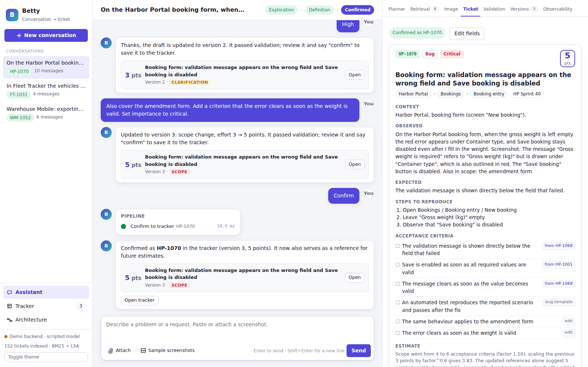
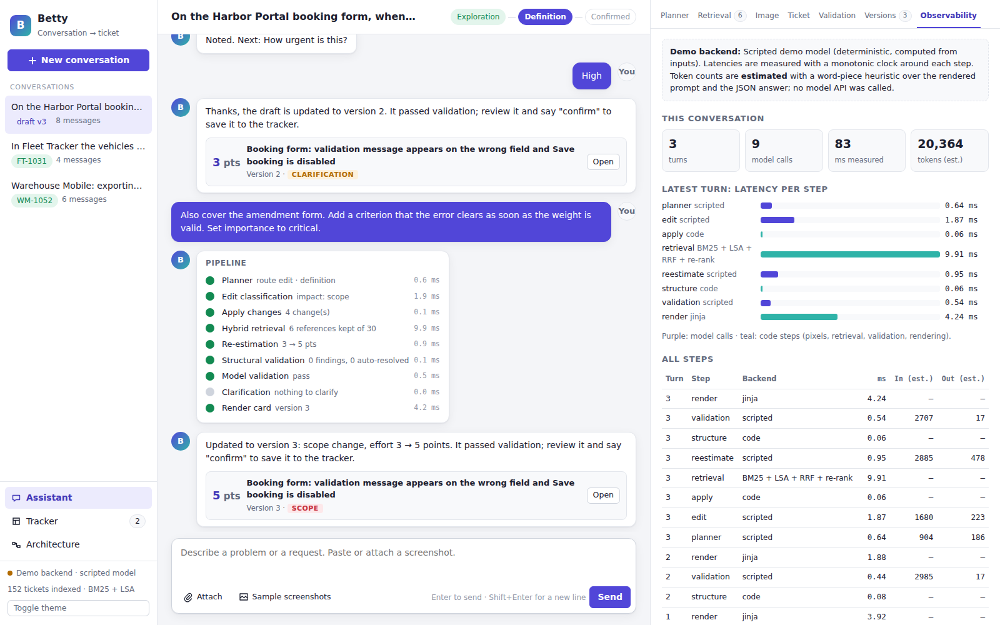
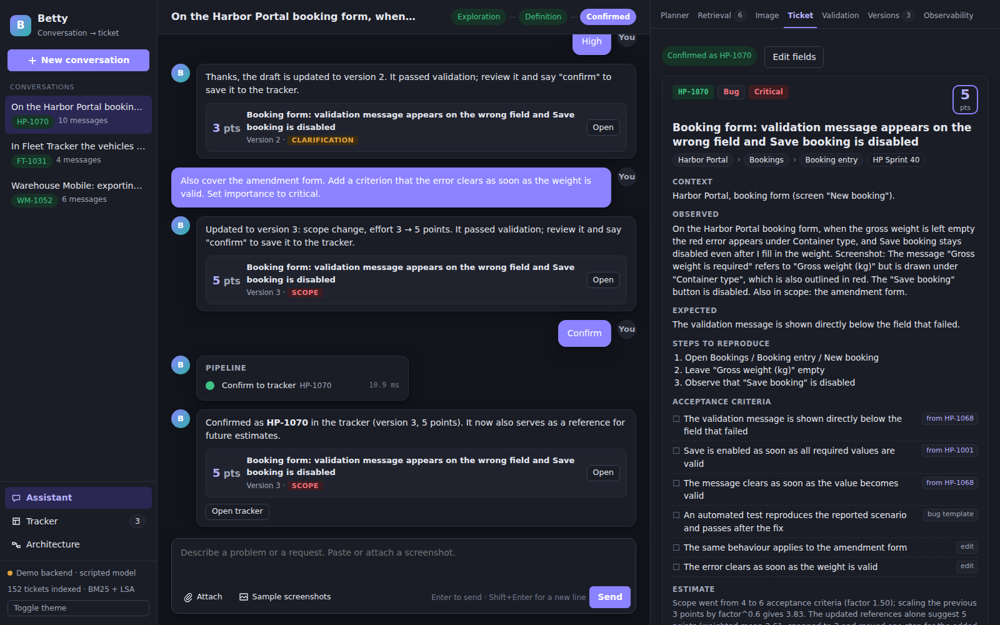
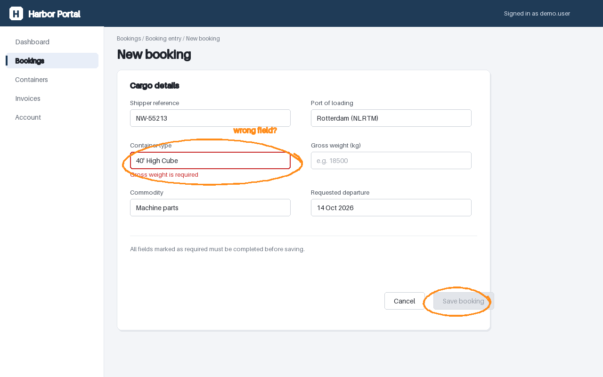
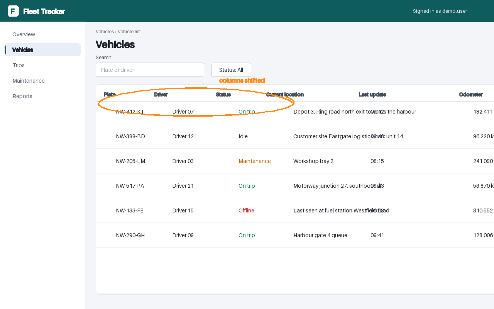
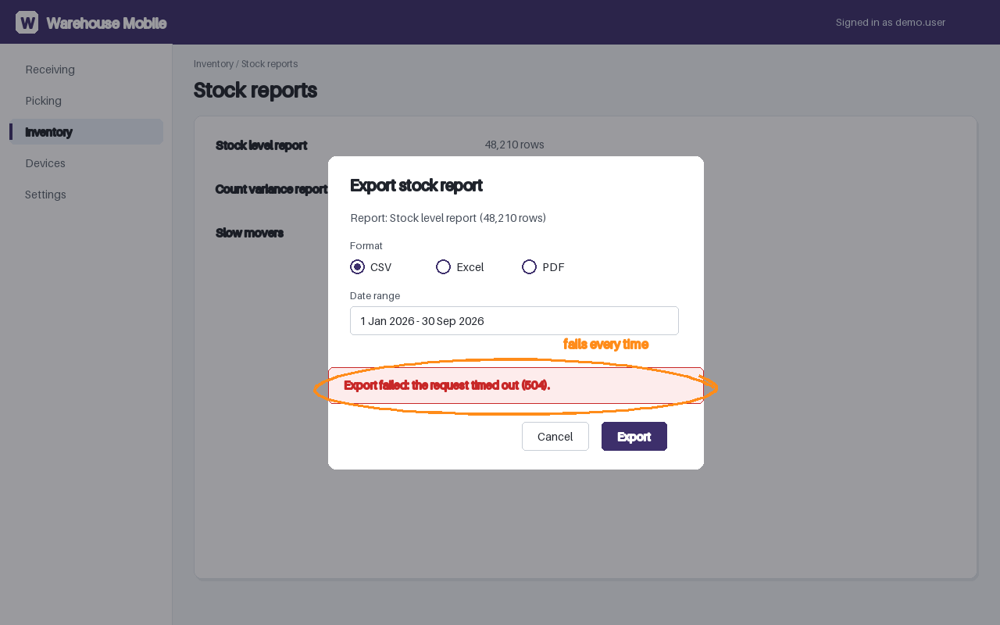

# Betty AI

**AI workflow automation for structured ticket authoring and evidence-based estimation.**

Describe a problem in chat and attach a screenshot. Betty plans the conversation, retrieves similar historical
tickets with hybrid keyword + vector search, drafts a structured ticket with an effort estimate grounded in those
tickets, validates it, asks only for what is missing, and keeps a person in charge of every edit and the final
confirmation.




| At a glance | |
|---|---|
| **Problem** | Turning a conversation about a bug or request into a well-filed, testable, estimated ticket is slow, and estimates are rarely anchored in similar past work. |
| **What Betty does** | Planner → screenshot analysis → hybrid retrieval → evidence-grounded ticket and estimate → structural + model validation → clarification → human editing → confirmed ticket. |
| **Key techniques** | Execution planner, BM25 + dense vectors, reciprocal rank fusion, feature-based re-ranking, schema-checked JSON output, impact-classified edits with re-estimation. |
| **Human in the loop** | The model drafts; the person answers clarifications, edits fields or asks for changes in chat, compares versions and confirms. |
| **This repository** | Architecture, workflow, technical write-ups and screenshots of a portfolio showcase. Source code is not included. |

---

## Overview

Betty is designed around one idea: **every field in a generated ticket should have visible evidence.** The effort
estimate names the reference tickets it came from and their weights; acceptance criteria show whether they came from
a reference ticket, the clarification or the bug template; metadata (project, module, process, iteration) is inferred
from the references and repaired by code when the hierarchy is invalid. The language model only returns structured
data — rendering, ticket keys and hierarchy repairs are the code's job.

The screenshots in this repository come from a **portfolio showcase** that re-implements the design on a fictional
software company with a synthetic ticket history. It is described separately from the production assistant it is
based on; see [Production context vs. this showcase](#production-context-vs-this-showcase).

## Key Capabilities

- **Conversation planning** — each turn is routed (`chat`, `create`, `edit`, `clarify`, `confirm`) with a maturity
  stage (*Exploration → Definition → Confirmed*), the capabilities it needs and a retrieval query.
- **Screenshot context** — error-coloured regions and the user's own markings are located in the image and combined
  with the visible text into a problem statement and reproduction steps.
- **Hybrid retrieval** — keyword (BM25) and vector rankings run in parallel, are fused with reciprocal rank fusion and
  re-ranked; every candidate's four scores are inspectable.
- **Evidence-based estimation** — effort is a relevance-weighted mean of the references' points, snapped to the
  1-2-3-5-8-13 scale, with written reasoning.
- **Two-level validation** — a structural check of the project hierarchy (with automatic repair when exactly one fix
  makes sense) and a model check of the content.
- **Clarification wizard** — open gaps become questions with options drawn from the references.
- **Human editing with re-estimation** — edits are classified by impact; scope changes trigger a new estimate and a
  version diff.
- **Observability** — per-step latency, model calls vs. code steps, token counts.

## System Architecture


More detail: [docs/architecture.md](docs/architecture.md).

## Workflow


Stage by stage, with the walkthrough shown in the screenshots: [docs/workflow.md](docs/workflow.md).

## Technical Highlights

| Area | What is done | Why it matters |
|---|---|---|
| **Planner** | Decides route, maturity and needed capabilities per message; builds and expands the retrieval query with screenshot findings. | Expensive stages run only when the conversation is ready for them; the assistant asks instead of guessing. |
| **Hybrid retrieval** | BM25 ∥ dense vectors → reciprocal rank fusion (k = 60) → feature-based re-ranker → score filter (top 6). | Keyword search catches exact terms (field names, error text); vectors catch paraphrases; fusion is robust without score calibration. |
| **Evidence-grounded estimate** | Weights are squared re-rank scores; result snapped to the point scale; adjusted one step when the draft's scope differs from the references. | The estimate is explainable and auditable — the reasoning lists every reference and weight. |
| **Structured output** | One request per model task with a prompt, structured context and a JSON schema; answers are schema-checked before use. | The pipeline never depends on free text parsing; malformed answers are caught at the boundary. |
| **Model never emits HTML or IDs** | The ticket card is rendered from JSON by a template; keys and hierarchy fixes are assigned by code. | No hallucinated identifiers, no injected markup, consistent output. |
| **Clarification wizard** | A small state machine (idle → asking → complete) driven by validation findings. | Users answer two targeted questions instead of rewriting the request. |
| **Edit impact + re-estimation** | Edits are classified (cosmetic / clarification / metadata / scope); scope edits blend the scaled previous estimate with a fresh retrieval-based one. | Estimates stay consistent with what the ticket now covers, and the diff shows why. |
| **Observability** | Latency per step, model vs. code steps, token counts per call. | Makes cost and latency of an agentic workflow visible stage by stage. |

Deep dives: [docs/technical_overview.md](docs/technical_overview.md) ·
[docs/retrieval_and_estimation.md](docs/retrieval_and_estimation.md)

## User Interface

| | |
|---|---|
|  **Input.** A request with a screenshot of a fictional booking form; the orange marking is the user's own annotation. |  **Planner.** Route `create`, maturity *Definition*, capabilities, the signals found in the conversation and the expanded retrieval query. |
|  **Screenshot analysis.** Error-coloured regions and user markings located in the image; the finding that "Gross weight is required" is drawn under the wrong field. |  **Retrieval explorer.** BM25 rank, vector rank, fused score and re-rank score for every candidate; 6 of 30 kept. |
|  **Ticket draft.** Rendered card with hierarchy path, observed / expected behaviour, steps, criteria with their origin, and the estimate's reasoning. |  **Validation + clarification.** A closed iteration auto-resolved by the structural check; the model check asks what should happen instead. |
|  **Edit + re-estimate.** "Also cover the amendment form…" is classified as a scope change; effort goes from 3 to 5 points with a field diff. |  **Observability.** Per-step latency, model calls vs. code steps, and token counts (labelled as estimates in the demo). |
|  **Tracker + export.** Confirmed tickets in a local mock tracker with CSV / JSON export; confirmed tickets join the retrieval corpus. |  **Dark theme.** |

Synthetic input screenshots used in the walkthroughs (fictional products, generated for the showcase):

| | | |
|---|---|---|
|  |  |  |
| Validation message under the wrong field | Table columns misaligned with the header | Export fails with a time-out |

## Engineering Focus

- **Agentic workflow with explicit control flow.** The planner chooses; the pipeline executes visible, timed stages.
  No hidden multi-step reasoning decides what reaches the user.
- **Retrieval as the source of truth for estimates.** References are supplied by the backend, not invented by the
  model, so every estimate can be traced to concrete historical tickets.
- **Strict model boundary.** Prompt, context and JSON schema per task; schema validation before use; deterministic
  code for rendering, IDs and repairs.
- **Human-in-the-loop by design.** Clarification instead of assumption, editable fields, version diffs and an explicit
  confirmation step.
- **Testable core.** Retrieval, planning, validation and rendering run without a web server; the demo model is
  deterministic, so the same conversation always produces the same draft.

## Production context vs. this showcase

**Production context.** Betty is based on an internal assistant the author built in a previous role. That system used
an execution planner (intent, workflow, retrieval query, readiness, clarification), hybrid vector + keyword retrieval
over historical tickets (**pgvector with local embeddings**), re-ranking, ticket generation and validation, and human
editing without extra LLM calls. Effort estimates were grounded in retrieved historical tickets, with the references
supplied by the backend rather than the LLM, and missing metadata was resolved through structured clarification
against options synced from the project-management system. That system has no published evaluation or business
metrics, so **none are quoted here**.

**This showcase** is an independent re-implementation of those ideas with its own data, prompts and fictional company:

| | Production assistant | Portfolio showcase |
|---|---|---|
| Ticket history | Real historical tickets (not published) | ~150 synthetic tickets of a fictional company |
| Vector search | pgvector, local embeddings | Dense LSA vectors computed in NumPy; optional ONNX sentence encoder |
| Model | LLM backend | Deterministic scripted model by default; optional OpenAI-compatible endpoint (e.g. a local Ollama model) |
| Tracker | Project-management system | Local SQLite mock tracker |
| UI | — | FastAPI + vanilla JavaScript, streamed with server-sent events |

## Demo / Portfolio Scope

Walkthrough persona used in this documentation: **trung.pn** is the requester who reports the booking-form bug,
answers the clarification and confirms the ticket; **nghia.pn** is the engineer who would pick it up; **tai.tv**
administers the tracker. The showcase itself has no accounts — the personas only make the story concrete.

**Demo limitations** (stated plainly):

- **Screenshot analysis is not full visual understanding.** In demo mode, pixel regions (red error states, the user's
  orange markings) are computed from the image, but the *visible text and UI element boxes* come from ground truth
  embedded in the generated screenshots. A vision-language backend would read the text from pixels instead.
- **The scripted model is not a language model.** It is deterministic and understands only the English phrasing and
  edit commands the walkthrough uses. Open-ended conversations need a real model backend.
- **Token counts are estimates**, not counts from a real tokenizer; latencies are measured on the machine running the
  demo.
- **Numbers in the walkthrough are demo outputs** on synthetic data — e.g. 6 of 30 candidates kept, an estimate of
  3 points rising to 5 after a scope edit. They are not accuracy, time-saving or adoption figures.
- **Retrieval is easier than in reality**: ~150 template-based tickets are cleaner than a real, noisy history.
- **No real tracker integration, authentication or multi-user features.**

## Repository Scope

This repository contains documentation and portfolio-safe assets.
Source code is intentionally not included.

```
README.md
docs/
  architecture.md               components, model boundary, persistence
  workflow.md                   the request-to-ticket workflow, stage by stage
  technical_overview.md         planner, screenshot analysis, validation, edits, observability
  retrieval_and_estimation.md   hybrid retrieval, fusion, re-ranking and the estimate
assets/
  screenshots/                  UI captured from the running showcase (synthetic data)
  diagrams/                     architecture and workflow diagrams (SVG)
  demo/                         synthetic input screenshots of fictional products
```

## Disclaimer

All companies, products, tickets, ticket keys and screenshots shown here are fictional and generated for the
showcase. Nothing in this repository comes from an employer, customer or production system, and no production
metrics are claimed. Shared for portfolio review; no licence is granted to reuse the images or text.

© 2026 Phạm Ngọc Trung
