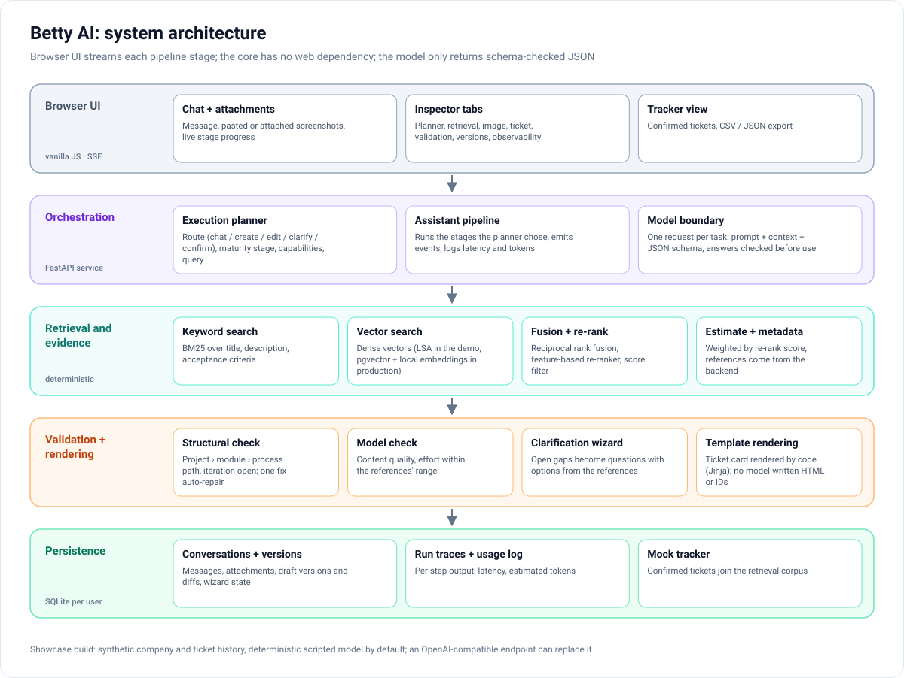
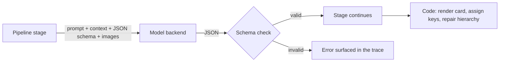
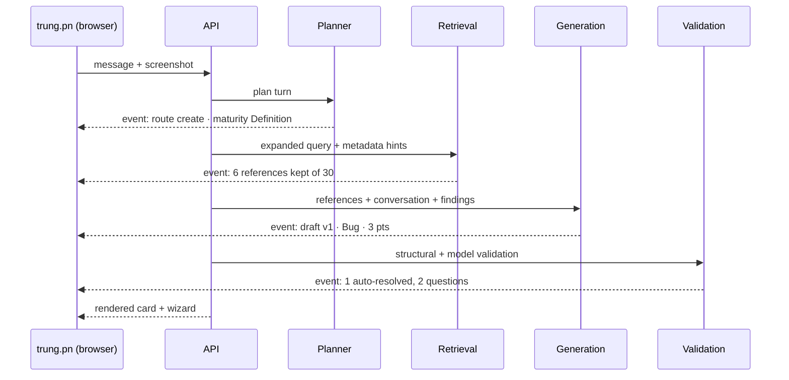

# Architecture

[← Back to README](../README.md)

Betty is a web service with a browser UI. The pipeline core — planning, retrieval, generation, validation,
rendering — has no web dependency and is tested without a server; the web layer is a thin API and an event stream
on top of it.

## Layers

| Layer | Responsibility |
|---|---|
| **Browser UI** | Chat with attachments (file picker, paste or sample screenshots) and live stage progress; inspector tabs for Planner, Retrieval, Image, Ticket, Validation, Versions and Observability; tracker page with export. Vanilla JavaScript and CSS, no build step. |
| **Orchestration** | A FastAPI service. Each user turn becomes one run: the planner decides the route, the assistant pipeline executes the stages it needs, and each stage emits an event (streamed to the browser with server-sent events) and a trace entry. |
| **Retrieval and evidence** | Keyword and vector rankings over the ticket history, fused and re-ranked; the selected references drive the estimate and the metadata. |
| **Validation and rendering** | Structural hierarchy validation, model validation, the clarification wizard, and template rendering of the ticket card. |
| **Persistence** | One SQLite database per user: conversations, messages, attachments, run traces, draft versions, wizard state, the usage log and the mock tracker. |

## The model boundary

Every model task — planner, image analysis, ticket generation, ticket validation, edit classification,
re-estimation and chat reply — goes through **one request type**:

- the prompt for that task, rendered from a template,
- the structured context it was rendered from,
- the task's **JSON schema**,
- any images.

Answers are checked against the schema before the pipeline uses them. The model **never** produces HTML, ticket keys
or hierarchy repairs: those are deterministic code. This keeps the model swappable — the showcase ships with a
deterministic scripted model and can be pointed at an OpenAI-compatible endpoint (for example a local model served
by Ollama) without changing the pipeline.

## Data flow of one "create" turn

## Persistence and state

- **Draft versions** are stored per conversation; the Versions tab shows a field-by-field diff between versions.
- **Wizard state** (idle → asking → complete) survives a page reload.
- **Run traces** keep the output of every stage, which is what the inspector tabs display.
- **Confirmed tickets** are written to the mock tracker and **join the retrieval corpus**, so they become references
  for later estimates.

## Production vs. showcase components

| Concern | Production assistant | Showcase |
|---|---|---|
| Vector store | PostgreSQL + pgvector | In-memory dense vectors (LSA), optional ONNX sentence encoder |
| Embeddings | Local embedding model | TF-IDF (unigrams + bigrams) reduced by SVD to 96 dimensions |
| Model | LLM backend | Scripted deterministic model; optional OpenAI-compatible endpoint |
| Tracker | Project-management system (options synced from it) | SQLite mock tracker |

No production metrics exist for the original system, and none are given for the showcase.
