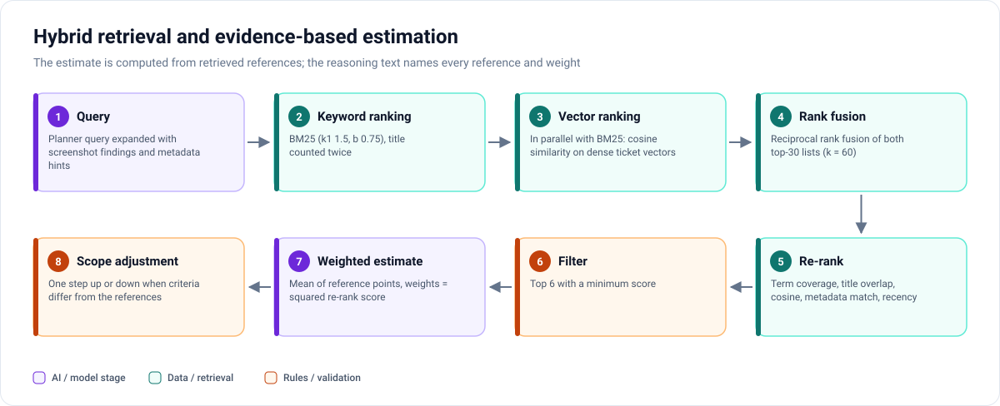

# Hybrid retrieval and evidence-based estimation

[← Back to README](../README.md)

Estimates are only as good as the past work they are anchored in. Betty therefore treats retrieval as the source of
the estimate, not as optional context for the model.

## Query

The planner builds the query from the user's words. After screenshot analysis it is **expanded with the image
findings** (for example the screen name and the detected problem), and the planner adds metadata hints such as the
project.

## Keyword ranking (BM25)

- BM25 with k1 = 1.5 and b = 0.75.
- Fields: title (counted twice), description and acceptance criteria.
- A small stemmer and stop-word list.

Keyword search is strong on exact terms that matter in tickets: field labels, error messages, screen names.

## Vector ranking

Run in parallel with BM25. In the showcase the dense vectors are TF-IDF over unigrams and bigrams with sublinear term
frequency, reduced to 96 dimensions by truncated SVD (latent semantic analysis), compared with cosine similarity. An
ONNX sentence encoder can be used instead. The production assistant used **pgvector with local embeddings**.

Vectors catch paraphrases ("Save stays disabled" vs. "cannot submit the form").

## Reciprocal rank fusion

The top 30 of each list are fused with reciprocal rank fusion (k = 60). RRF uses ranks rather than raw scores, so
BM25 scores and cosine similarities never need to be calibrated against each other.

## Re-ranking

A feature-based cross-scorer looks at the query and each candidate together:

| Feature | Intuition |
|---|---|
| Query-term coverage | How much of the problem the candidate talks about |
| Title overlap | Titles are dense summaries |
| Cosine similarity | Semantic closeness |
| Metadata match | Same project / module / process / job type as the planner's hints |
| Recency | 180-day half-life; recent work reflects the current codebase and team |

The top 6 with a score of at least 0.38 are kept. The retrieval explorer shows every candidate's BM25 rank, vector
rank, fused score and re-rank score, and the features behind the re-rank score.

## The estimate

1. **Weighted mean** of the references' points; the weights are the squared re-rank scores, so the closest references
   dominate.
2. **Snap** to the 1-2-3-5-8-13 scale on a log scale.
3. **Scope adjustment:** move one step when the draft has at least 1.5 more (or fewer) acceptance criteria than the
   references average.
4. **Reasoning text** names every reference, its points and its weight.

On a **scope edit**, two estimates are averaged: the previous estimate scaled by (criteria growth)^0.6, and a fresh
estimate from references retrieved for the edited draft.

## Metadata inference

Project, module, process and iteration are voted on by the same references (weighted by re-rank score); values the
conversation names explicitly win over the vote. Importance is also taken from the references. When the references disagree — for example on importance — the model validator turns the
disagreement into a clarification question instead of picking silently.

## What is and is not claimed

The retrieval and the estimate are real computations on the showcase's synthetic corpus of ~150 tickets. There is no
evaluation on real tickets (no recall@k, no estimate error), and none is claimed. An evaluation harness on held-out
historical tickets would be the next step for a real deployment.
