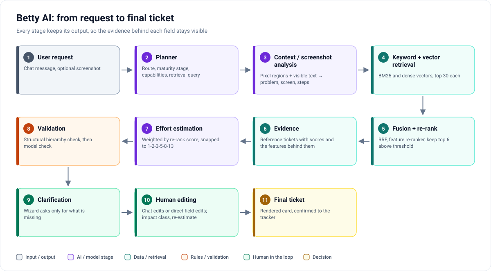
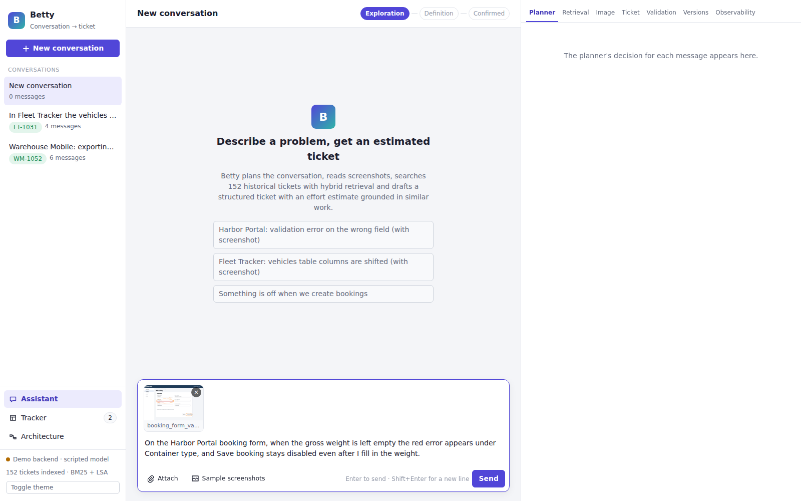
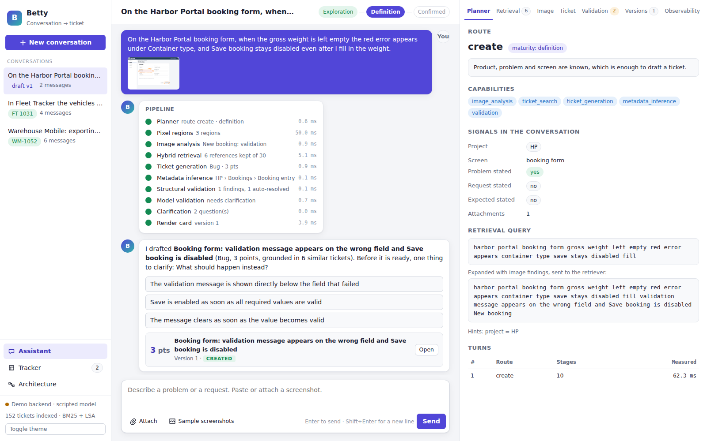
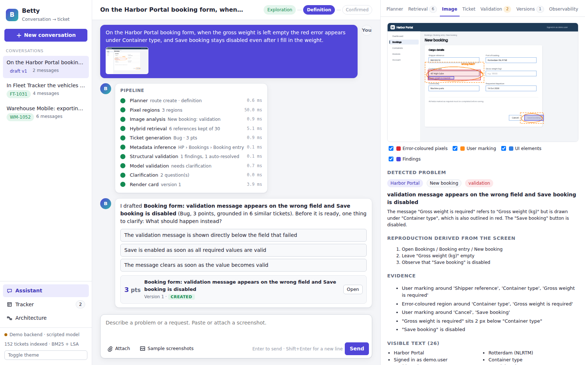
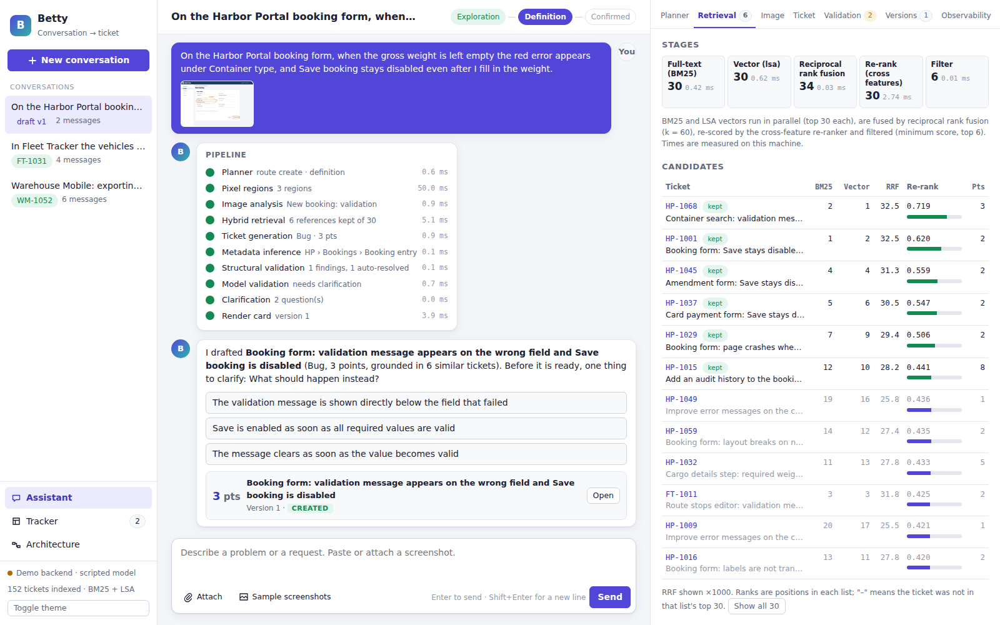
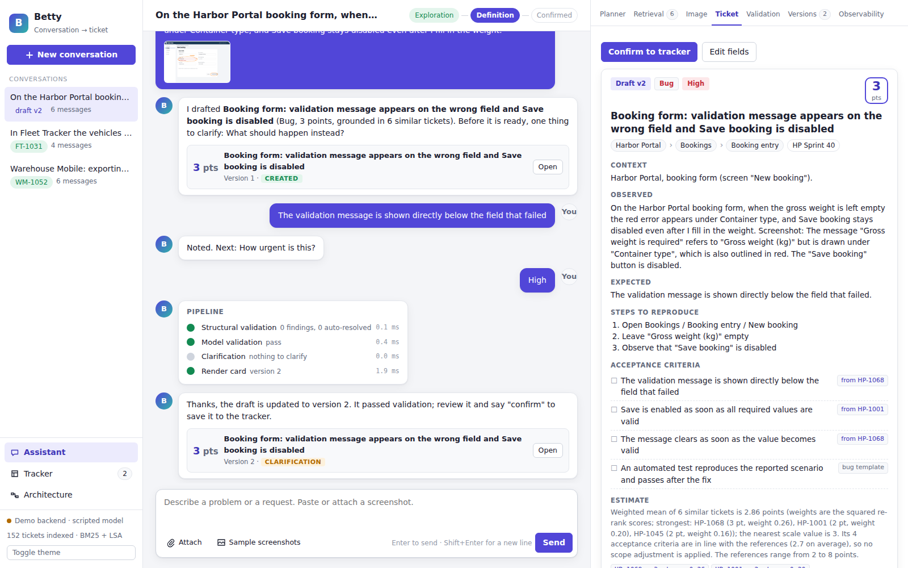
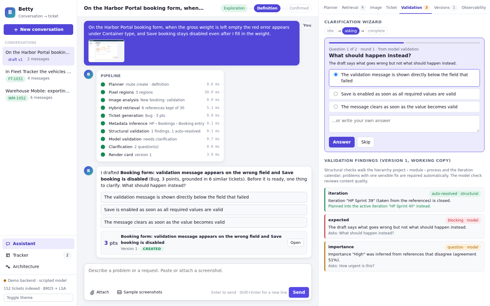
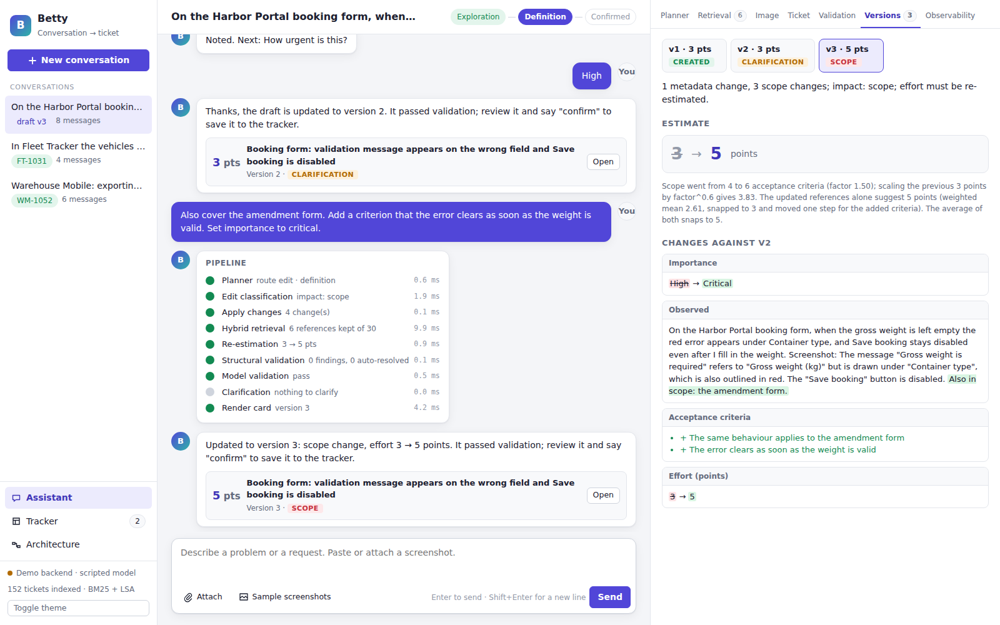
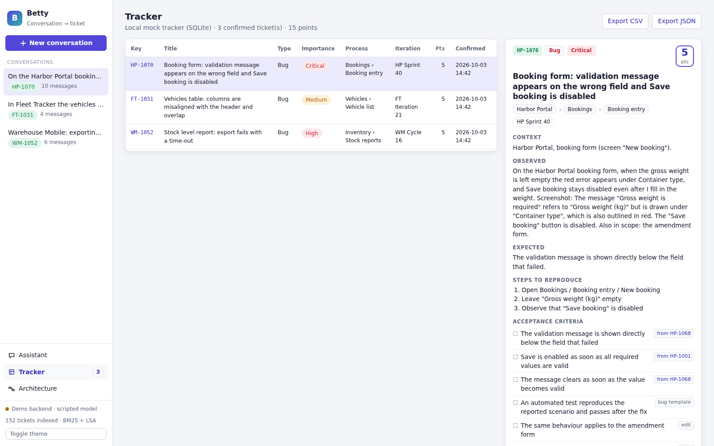
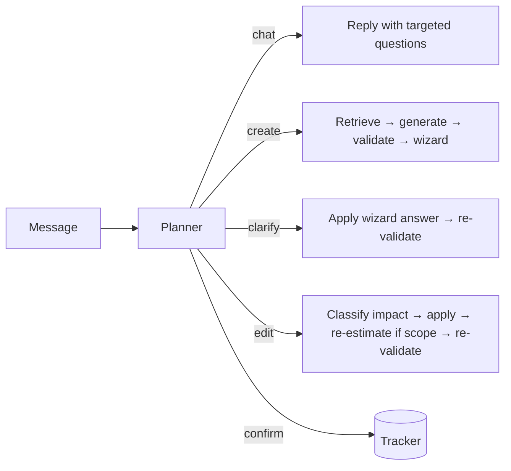

# Workflow: from request to final ticket

[← Back to README](../README.md)

The walkthrough below follows one conversation in the showcase. The requester, **trung.pn**, reports a bug in a
fictional logistics portal ("Harbor Portal"). All values are demo outputs on synthetic data.

## 1. User request

trung.pn writes: *"On the Harbor Portal booking form, when the gross weight is left empty the red error appears under
Container type, and Save booking stays disabled even after I fill in the weight."* and attaches a screenshot on which
they circled the problem in orange.

## 2. Planner

The planner reads what the conversation has established — product, screen, whether a problem, a request and the
expected behaviour are stated, attachments — and decides:

- **route:** `create` (enough to draft a ticket),
- **maturity:** *Definition* (problem known, expected behaviour not yet stated),
- **capabilities:** image analysis, ticket search, ticket generation, metadata inference, validation,
- **retrieval query:** the user's words, later expanded with the screenshot findings, plus a project hint.

## 3. Context / screenshot analysis

Pixel regions are computed from the image: error-coloured areas and the user's orange markings, as connected
components. Combined with the screen's visible text, the analysis concludes that the message "Gross weight is
required" is drawn under *Container type* and that *Save booking* is disabled, and derives reproduction steps.

> **Demo limitation:** in the showcase the visible text and element boxes come from ground truth embedded in the
> generated screenshot; only the pixel regions are computed from the image. A vision-language backend would read
> the text from pixels.

## 4–6. Keyword + vector retrieval → fusion + re-rank → evidence

BM25 and vector search each return their top 30 candidates; reciprocal rank fusion merges them; a feature-based
re-ranker scores every candidate against the query; the top 6 above a minimum score become the **evidence**. The
retrieval explorer shows each candidate's BM25 rank, vector rank, fused score and re-rank score, and the re-ranker's
features on click. Details: [retrieval_and_estimation.md](retrieval_and_estimation.md).

## 7. Effort estimation

The estimate is the relevance-weighted mean of the references' story points (weights = squared re-rank scores),
snapped to 1-2-3-5-8-13. In the walkthrough the weighted mean is about 2.9, so the draft gets **3 points**, and the
reasoning names each reference and its weight. Metadata (project › module › process, iteration) is a weighted vote
over the same references, unless the conversation names it; importance is also taken from the references.

## 8. Validation

- **Structural:** the path project › module › process must exist and the iteration must belong to the project and be
  open. The references point to a closed sprint, so the draft is **moved to the active sprint automatically** — a
  problem with exactly one sensible fix is repaired and reported.
- **Model:** content quality — title, observed and expected behaviour, number of acceptance criteria, effort within
  the references' range, agreement of the references on importance. Here it finds that the expected behaviour is
  missing and that the references disagree on importance.

## 9. Clarification

Each open finding becomes a wizard question with options taken from the references, plus free text:
*"What should happen instead?"* and *"How urgent is this?"*. trung.pn picks an option for the first and answers
"High" to the second; the draft becomes version 2.

## 10. Human editing

trung.pn asks in chat: *"Also cover the amendment form. Add a criterion that the error clears as soon as the weight is
valid. Set importance to critical."* The edit is classified as a **scope** change, so the ticket is re-estimated:
the previous estimate scaled by the growth in acceptance criteria and a fresh retrieval-based estimate are averaged,
giving **5 points**. The Versions tab shows the field-by-field diff. Fields can also be edited directly.

## 11. Final ticket

trung.pn confirms. The ticket is rendered from JSON by a template, written to the mock tracker, and joins the
retrieval corpus for future estimates. nghia.pn, as the engineer, would pick it up from the tracker; tai.tv exports
the tracker as CSV or JSON.

## Routes other than `create`

The persona names (trung.pn, nghia.pn, tai.tv) are for the walkthrough only; the showcase has no accounts.
